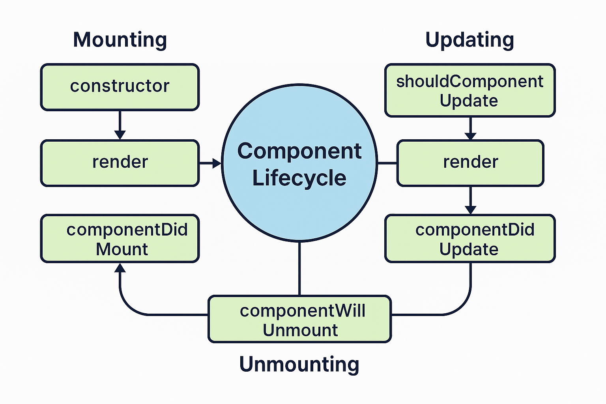

# 🔄 What is Component Lifecycle?

In React, each component goes through a **lifecycle**: it gets **created**, **updated**, and eventually **destroyed**.

React provides **lifecycle methods (in class components)** and **hooks (in functional components)** to let you run code during these different phases.

---

## 🧱 3 Main Phases of Component Lifecycle:

| Phase          | Description                                        |
| -------------- | -------------------------------------------------- |
| **Mounting**   | Component is **created and inserted** into the DOM |
| **Updating**   | Component **re-renders** due to state/props change |
| **Unmounting** | Component is **removed** from the DOM              |

---

## 🏛️ Class Component Lifecycle Methods:

Here are the main methods you use in **class-based components**:

### 1️⃣ **Mounting Phase**

| Method                | When it runs                              |
| --------------------- | ----------------------------------------- |
| `constructor()`       | When the component is initialized         |
| `render()`            | When JSX is being rendered                |
| `componentDidMount()` | After the component is mounted to the DOM |

```jsx
class MyComponent extends React.Component {
  constructor(props) {
    super(props);
    this.state = { count: 0 };
  }

  componentDidMount() {
    console.log('Component mounted!');
  }

  render() {
    return <h1>Hello</h1>;
  }
}
```

---

### 2️⃣ **Updating Phase**

Triggered when **state or props** change.

| Method                    | Purpose                      |
| ------------------------- | ---------------------------- |
| `shouldComponentUpdate()` | Decide whether to re-render  |
| `componentDidUpdate()`    | Runs **after** update/render |

---

### 3️⃣ **Unmounting Phase**

| Method                   | Purpose                                                        |
| ------------------------ | -------------------------------------------------------------- |
| `componentWillUnmount()` | Cleanup before the component is destroyed (e.g., clear timers) |

```jsx
componentWillUnmount() {
  console.log('Component is about to be removed');
}
```

---

## ⚛️ Functional Components & Hooks

In **modern React**, we use **hooks** (like `useEffect`) for lifecycle behavior in **functional components**.

---

### 🧠 `useEffect()` = Lifecycle Hook

It combines **`componentDidMount`**, **`componentDidUpdate`**, and **`componentWillUnmount`**.

```jsx
import { useEffect } from 'react';

function MyComponent() {
  useEffect(() => {
    console.log('Component mounted or updated');

    return () => {
      console.log('Component unmounted');
    };
  }, []); // empty dependency array = run only on mount
}
```

---

### 💡 `useEffect()` Variants:

| Pattern                               | Acts like                        |
| ------------------------------------- | -------------------------------- |
| `useEffect(() => {...}, [])`          | `componentDidMount`              |
| `useEffect(() => {...}, [count])`     | `componentDidUpdate` (for count) |
| `return () => {...}` inside useEffect | `componentWillUnmount`           |

---

## ✅ Summary

| Phase   | Class Component          | Functional Component     |
| ------- | ------------------------ | ------------------------ |
| Mount   | `componentDidMount()`    | `useEffect(..., [])`     |
| Update  | `componentDidUpdate()`   | `useEffect(..., [deps])` |
| Unmount | `componentWillUnmount()` | Cleanup in `useEffect()` |

